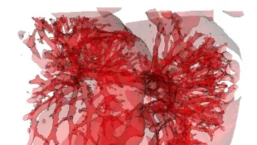

# 3DImageToolkit: a framework for Medical Image Segmentation and Filtering
A C++ library to perform basic image filtering and a semi-automatic segmentation through the Connected Component Localization of the Region-Scalable Fitting Energy.

The theory behind this segmentation method can be found in details in the following [publication](http://ieeexplore.ieee.org/xpls/abs_all.jsp?arnumber=7306035&tag=1):

- Fedele, M., Faggiano, E., Barbarotta, L., Cremonesi, F., Formaggia, L., & Perotto, S. (2015, September). Semi-automatic three-dimensional vessel segmentation using a connected component localization of the Region-Scalable Fitting Energy. In *Image and Signal Processing and Analysis (ISPA), 2015 9th International Symposium on (pp. 72-77). IEEE.*

If you use this work, please don't forget to cite this paper.

## License
Copyright © 2013-2016 Luca Barbarotta, Francesco Cremonesi, Elena Faggiano, Marco Fedele. All Rights Reserved.

This library is released with the BSD license.
See file license.txt for all the details.

## Contacts
- **Marco Fedele**: [fedele.marco@gmail.com](mailto:fedele.marco@gmail.com)
- **Elena Faggiano**: [elena.faggiano@gmail.com](mailto:elena.faggiano@gmail.com)
- **Luca Barbarotta**: [luca.barbarotta@gmail.com](mailto:luca.barbarotta@gmail.com)
- **Francesco Cremonesi**: [francesco.cremonesi0@gmail.com](mailto:francesco.cremonesi0@gmail.com)



## Installation
This library is tested on Linux and exploits the following libraries:

- [cmake](http://www.cmake.org) to create the MakeFile
- [VTK](http://www.vtk.org) to visualize, to import and to save 3d images
- [fftw](http://www.fftw.org) to compute DFT efficiently
- [GetPot](http://getpot.sourceforge.net/) to import parameters from a data file

All these libraries must be installed before starting the installation.

Some notes:

- the library needs the fftw version working with openmp (if you compile it, use the option --enable-shared)
- GetPot can be download from the website and copied in your path, e.g. `/usr/include/`
- in debian based Linux distribution all the necessary packages (except GetPot) should be available with apt-get

Once installed all this packages you can exploit cmake to compile all the executables:

```
mkdir build_directory
cd path_to_build_directory
cmake path_to_source_directory
make
```

## Documentaion
To build documentation you need to install [doxygen](http://www.doxygen.org) and [graphviz](http://www.graphviz.org) and then type:

```
cmake path_to_source_directory -DBUILD_DOCUMENTATION=ON
make doc
```

The html guide is in `build_directory/doc/html/`

## Usage
Launch an executable without any option to see its helper.
